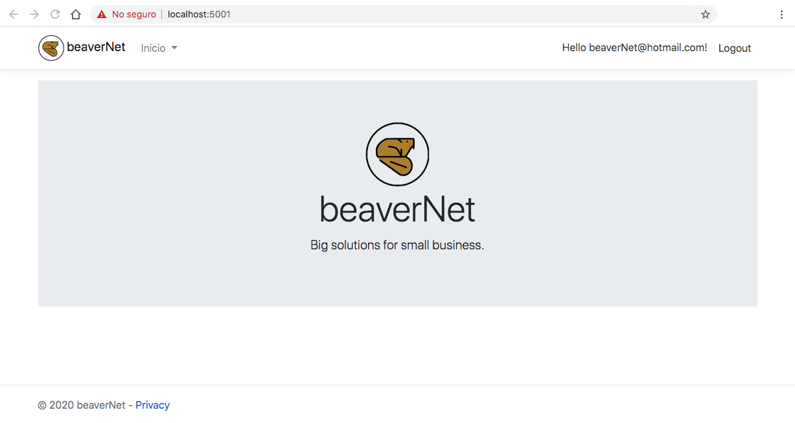

#  beaverNet

# In-Memory Identity web application
This is an implementation of ASP.NET Core 3.1 web application with MVC architecture using Entity Framework Core in memory database for default user identity.
**No database** engine needed! The app flush data once it stops execution.

## Prerequisites
- [.NET SDK](https://dotnet.microsoft.com/download)

## Run this app
Command Line instructions 
1. Clone this repository:
````
git clone https://github.com/JulioMelchorPinto/beaverNet.InMemoryWebApp.git
````
2. Enter directory
````
cd beaverNet.InMemoryWebApp/
````
3. Restore project's tools
````
dotnet tool restore
````
4. Restore NuGet packages
````
dotnet restore
````
5. Install dev certificates
````
dotnet dev-certs https --trust
````
6. Build principal project
````
dotnet build --project beaverNet.InMemoryWebApp/beaverNet.InMemoryWebApp.csproj
````
7. Run with dotnet command
````
dotnet run --project beaverNet.InMemoryWebApp/beaverNet.InMemoryWebApp.csproj --launch-profile beaverNet.InMemoryWebApp
````

## Samples




Sponsor:

[](https://paypal.me/beaverNet)]

